# Отчёт по лабораторной работе №3

### Настройка виртуальной машины vm1

Добавим соединение с интернетом, используя сетевой мост.
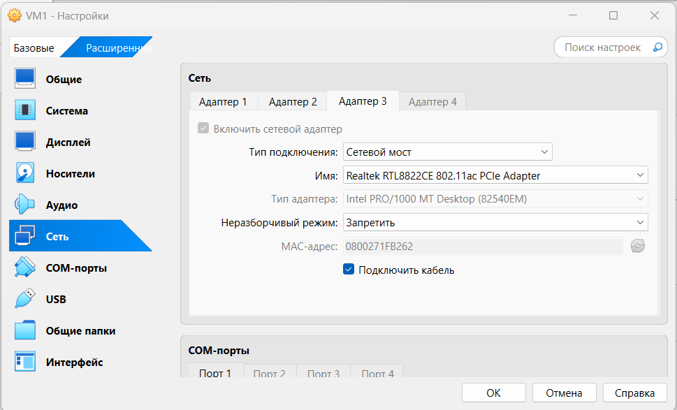
Проверим.
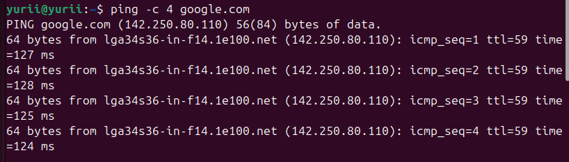

### Создадим виртуальную машину vm2.

Создадим виртуальный адаптер хоста.
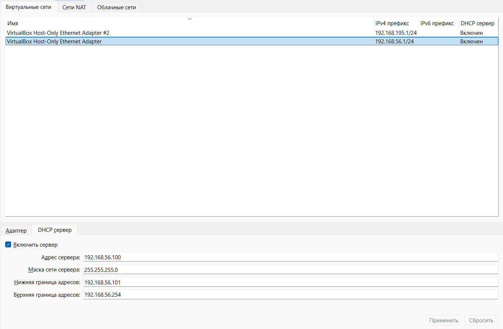
Подключим к нему vm2.
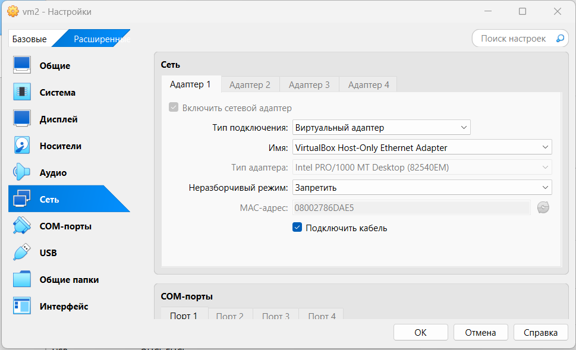
Подключим к нему vm1.
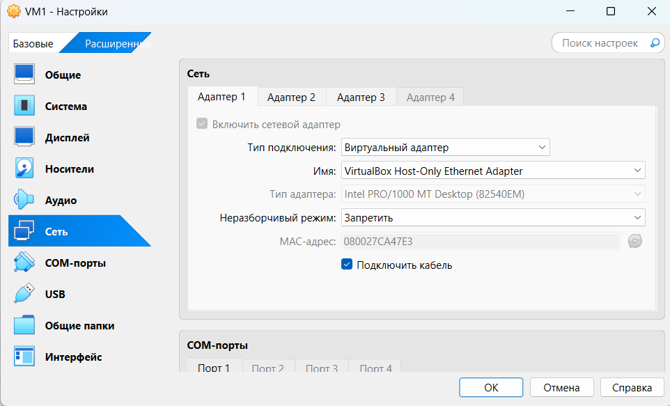
Проверим соединение между vm1 и vm2. От vm1 к vm2.
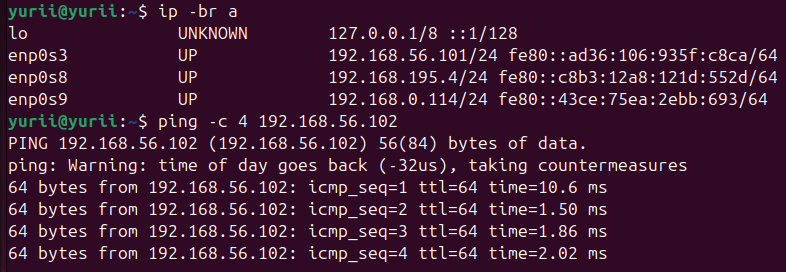
От vm2 к vm1.
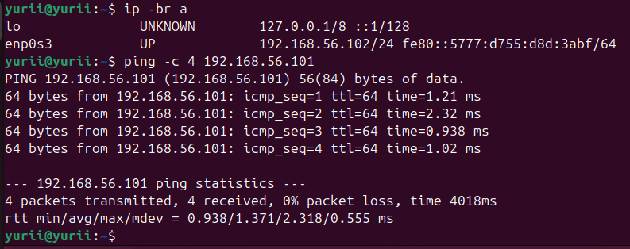

### Создадим виртуальную машину vm3.

Создадим ещё один виртуальный адаптер хоста.
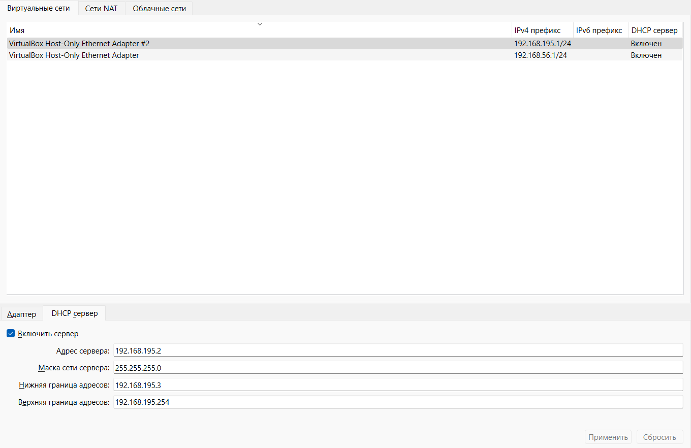
Подключим к нему vm3.
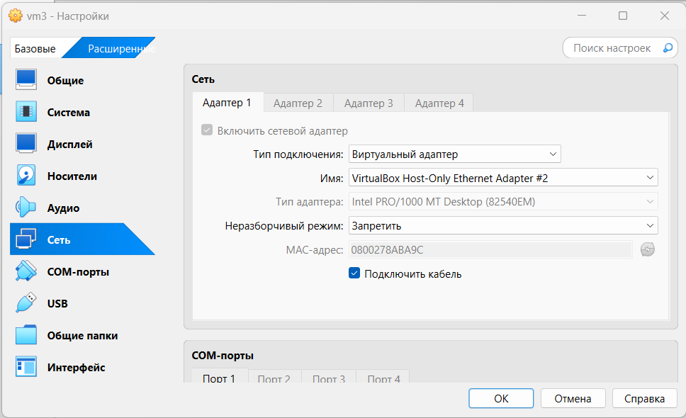
Подключим к нему vm1.
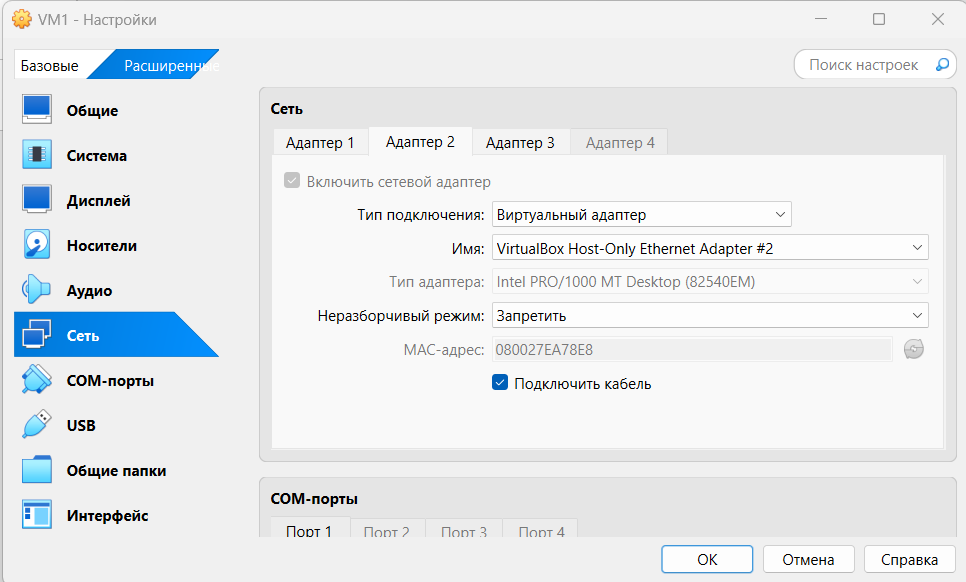
Проверим соединение между vm1 и vm3. От vm1 к vm3.
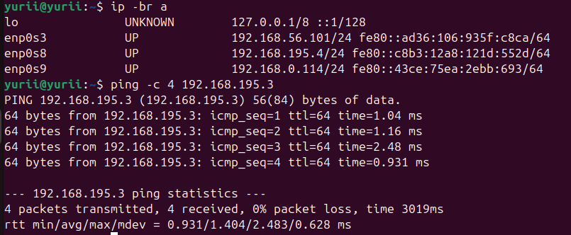
От vm3 к vm1.
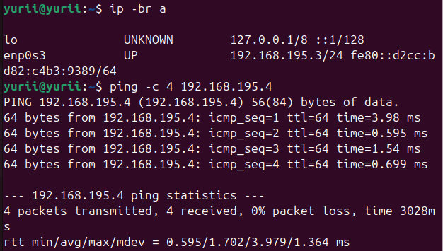

Запустим все три машины и проверим на корректность 
доступы к подключениям.
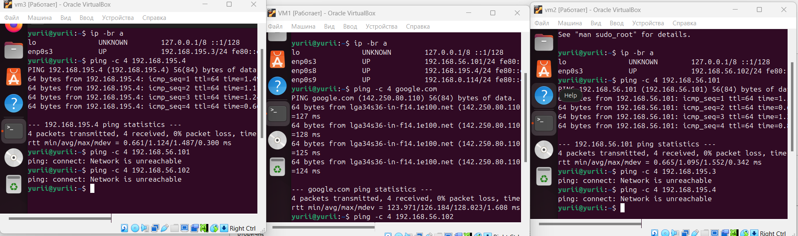
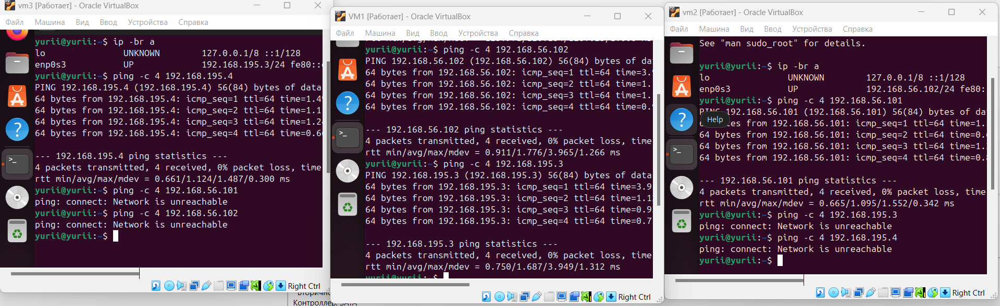